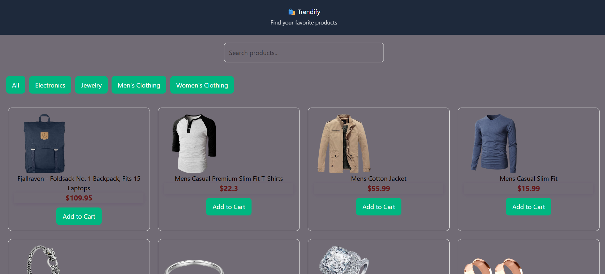
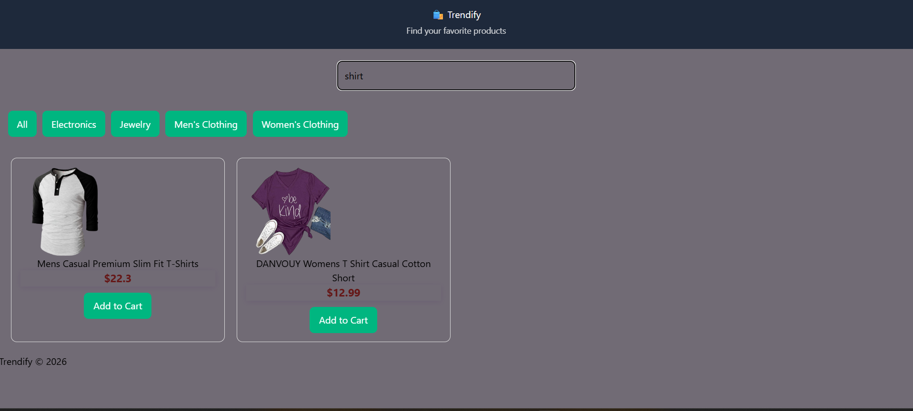
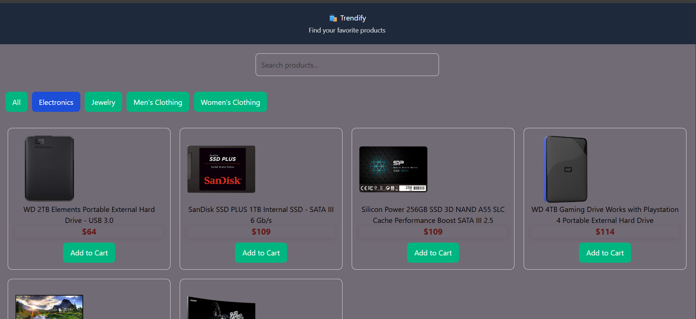
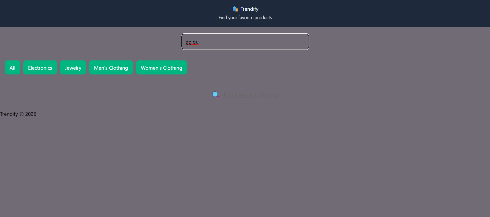
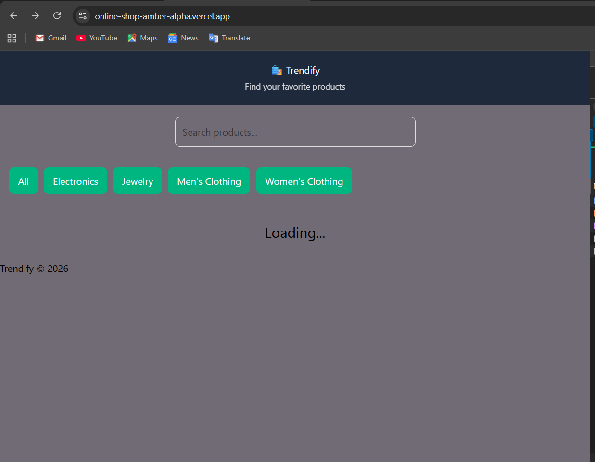

# 🛍️ Trendify

## 📖 Project Overview

Trendify is a React Single Page Application (SPA) built with Vite. The application fetches product data from the Fake Store API and displays it in a clean and responsive user interface.

Users can search for products by title and filter them by category. The project also handles loading, error, and empty states to improve the user experience.

---

## ✨ Features

- Fetch product data from the Fake Store API.
- Display products using reusable card components.
- Search products by title.
- Filter products by category.
- Loading spinner while data is being fetched.
- Error message when the API request fails.
- Empty state when no products match the search.
- Responsive design for desktop, tablet, and mobile devices.
- Custom Hook (`useFetch`) for reusable data fetching logic.
- Performance optimization using useMemo.
- Prevent unnecessary component re-rendering using React.memo.

---

## 🛠️ Technologies Used

- React
- Vite
- JavaScript (ES6+)
- CSS3
- Fake Store API

---

## ⚛️ React Concepts Used

- Functional Components
- Props
- useState
- useMemo
- Custom Hook (`useFetch`)
- React.memo

---

## 📂 Project Structure
ONLINE_SHOP
│
├── public
│
├── Screenshots
│   ├── HomePage.png
│   ├── search.png
│   ├── categories.png
│   ├── Loading.png
│   ├── Error message.png
│   ├── Noresult.png
│   └── responsive mobile.png
│
├── src
│   ├── assets
│   ├── components
│   │   ├── Navbar.jsx
│   │   ├── Searchbar.jsx
│   │   ├── Card.jsx
│   │   ├── Button.jsx
│   │   ├── LoadingSpinner.jsx
│   │   ├── ErrorMessage.jsx
│   │   └── Footer.jsx
│   │
│   ├── hooks
│   │   └── useFetch.js
│   │
│   ├── utils
│   ├── App.jsx
│   ├── App.css
│   ├── index.css
│   └── main.jsx
│
├── index.html
├── package.json
├── vite.config.js
└── README.md

---

## 🚀 Installation

Clone the repository:
git clone <repository-url>

Install dependencies:
npm install

Run the development server:
npm run dev

---

## 📦 Build for Production
npm run build

---

## 📸 Screenshots

### 🏠 Home Page

---

### 🔍 Search Function

---

### 📂 Category Filter

---

### ❌ Empty State

---

### 📱 Responsive Design

---

### ⏳ Loading State

---

### ⚠️ Error Message

---

## 💡 Challenges

One of the main challenges was organizing the application while keeping the code reusable and maintainable.

To solve this, I created a reusable custom hook (`useFetch`) to separate the data fetching logic from the UI components.

To improve performance, I used useMemo to avoid recalculating the filtered products unless the product list, search term, or selected category changes.

I also wrapped the Card component with React.memo to reduce unnecessary re-rendering.

---

## 🔮 Future Improvements

- Add a product details page.
- Implement a functional shopping cart.
- Add product sorting by price and rating.
- Add pagination for large product lists.
- Improve the user interface with animations.

---
---

## 🌐 Project Links

### 🔗 Live Demo

https://online-shop-amber-alpha.vercel.app/

### 💻 GitHub Repository

https://github.com/Bassant2004/online_shop

## 👩‍💻 Author

Bassant Khaled